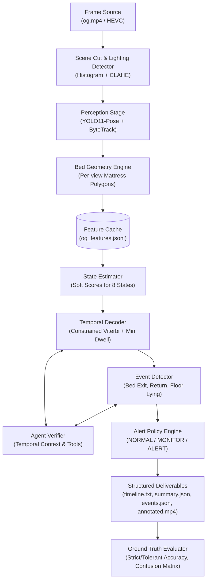
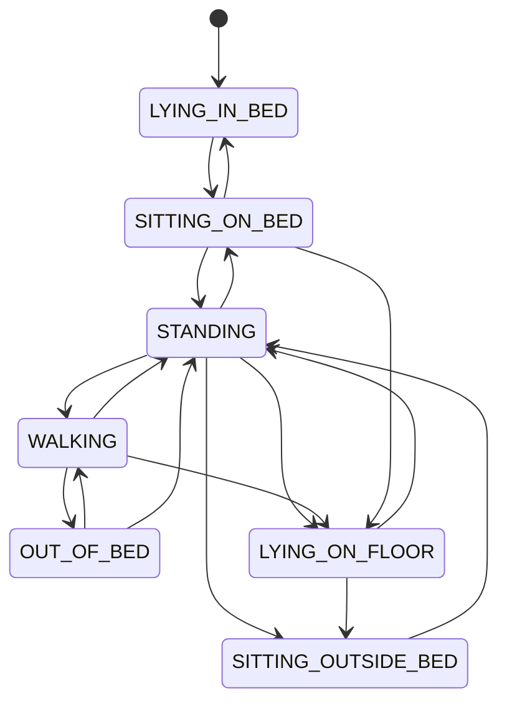
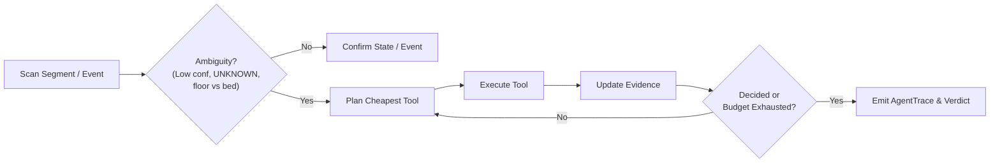

# Bedwatch: Agentic Vision System for Elderly Care & Bed Safety

Bedwatch is an agentic AI + Computer Vision system designed to analyze continuous indoor video of an elderly resident. It monitors resident safety by answering four fundamental operational questions:
1. **Activity Timeline**: What is the person doing over time?
2. **Bed Safety Events**: When do they exit or return to bed?
3. **Temporal Accounting**: How much time is spent in each activity state (and total time in bed vs. out of bed)?
4. **Contextual Alerts**: Does an event or situation warrant normal logging, active monitoring, or an immediate alert?

The system is built with open-source models (YOLO11-pose with ByteTrack, OpenCV, SciPy, Scikit-Learn) and runs entirely locally on a single consumer GPU (**NVIDIA RTX 3060, 6 GB VRAM**), with zero external API dependencies.

---

## 1. System Architecture

Bedwatch strictly decouples **perception** (pixels $\rightarrow$ per-frame geometric features) from **reasoning** (features $\rightarrow$ state timeline, event chains, and alert decisions).



### Architectural Principles
- **Decoupled Perception & Reasoning**: The perception stage processes raw video frames into standardized JSONL `FeatureRecord`s. The downstream reasoning pipeline is 100% CPU-executable and runs in seconds, enabling instant iteration and simulation without reprocessing heavy video frames.
- **Geometry First, VLM Last**: Pose keypoints, bounding box aspect ratios, and polygon distances handle 99% of frames explainably and efficiently. A local VLM is loaded only as a bounded fallback for ambiguous keyframes.
- **Explicit Temporal Modeling**: Avoids frame-by-frame flickering by decoding state scores with a **constrained Viterbi pass** over an allowed transition graph, supplemented by per-state **minimum dwell time smoothing**.
- **First-Class Abstention**: When evidence is obscured (e.g. behind curtains or severe occlusion), the system outputs `UNKNOWN` rather than forcing an inaccurate guess.

---

## 2. Activity State Taxonomy

Bedwatch tracks **8 discrete activity states**:

| State | Definition & Evidence | Bed Status |
|---|---|---|
| `LYING_IN_BED` | Horizontal posture ($\text{torso angle} > 48^\circ$, or $>38^\circ$ with aspect $> 1.15$) with hips and torso inside the mattress surface polygon. | In Bed |
| `SITTING_ON_BED` | Upright or reclined seated posture on mattress top surface ($\text{thigh angle} < 72^\circ$ or seated aspect); stationary speed. | In Bed |
| `SITTING_OUTSIDE_BED`| Seated posture off the bed (e.g. armchair near window, $\text{thigh angle} < 72^\circ$, compressed vertical ratio, or seated aspect). | Out of Bed |
| `STANDING` | Upright posture ($\text{torso angle} < 25^\circ$) with extended vertical legs ($\text{thigh angle} \ge 78^\circ$, narrow aspect $\le 0.38$, $\text{hip-to-ankle ratio} \ge 0.41$). | Out of Bed |
| `WALKING` | Upright traveling posture with sustained locomotion ($\text{speed} \ge 0.18\text{ bh/s}$). | Out of Bed |
| `OUT_OF_BED` | Resident not visible in camera view after having exited the bed area. | Out of Bed |
| `LYING_ON_FLOOR` | Horizontal posture with hips and torso completely outside mattress surface; low vertical position. | Out of Bed |
| `UNKNOWN` | Person present but keypoints occluded or unreadable (e.g. curtain occlusion). | Out of Bed |

> **Why add `LYING_ON_FLOOR`?**  
> Clinical safety requires differentiating normal rest (`LYING_IN_BED`) from a potential collapse (`LYING_ON_FLOOR`). Adding this state enables an immediate, uncompromised `ALERT` decision without needing ad-hoc heuristics.

---

## 3. Allowed Transition Graph & Viterbi Decoding

To enforce physically possible movements, the temporal decoder applies Viterbi pathfinding over an allowed transition graph:


*Transitions directly from `LYING_ON_FLOOR` to `LYING_IN_BED` are strictly disallowed (a person getting up from the floor must pass through standing or sitting).*

---

## 4. Bed Exit & Return Event Detection

Events are detected from contiguous state chains and geometric displacement:
- **`BED_EXIT`**:
  $$\text{In Bed (Lying / Sitting)} \longrightarrow \text{Standing} \longrightarrow \text{Moving away from bed / Out of bed}$$
  - Confirmed once distance to bed increases by $\ge 0.5\text{ body heights}$ or person leaves view.
  - Negative situations suppressed: turning in bed, sitting up, brief stand-and-sit-back, and aborted exits (one step then sitting back down).
- **`RETURN_TO_BED`**:
  $$\text{Out of bed} \longrightarrow \text{Approach bed} \longrightarrow \text{Sit on bed} \longrightarrow \text{Lie down in bed}$$
  - Confirmed after lying down on mattress for $\ge 2.0\text{s}$.
  - Negative situations suppressed: visiting bed edge without lying down (false return attempt).
- **`FLOOR_LYING`**:
  $$\text{Any non-floor state} \longrightarrow \text{LYING\_ON\_FLOOR}$$
  - Confirmed after $\ge 2.0\text{s}$ on floor $\implies$ Triggers immediate **`ALERT`**.

---

## 5. Agentic Verification Loop

When temporal ambiguity arises, an agentic verification loop gathers context before confirming states or events:



### Bounded Agent Tools
1. `get_previous_segment(t, window_s)`: Inspects what the resident was doing immediately prior (e.g. verifies whether the resident was in bed before standing).
2. `get_next_segment(t, window_s)`: Inspects succeeding motion (e.g. verifies if walking followed a brief curtain occlusion at 146–148s).
3. `recheck_bed_overlap(t)`: Re-samples mattress polygon containment across adjacent frames to disambiguate bed vs. floor lying.
4. `vlm_describe(keyframes)`: Bounded local vision-language query on keyframes if geometric evidence is borderline.

---

## 6. Contextual Alert Policy

The system produces three discrete safety decisions:

| Level | Condition | Clinical / Operational Rationale |
|---|---|---|
| **`NORMAL`** | Routine daily activities: lying, sitting, standing, walking, seated in chair, or brief bed departures. | Expected daily living patterns. |
| **`MONITOR`** | - Sitting on bed edge $> \text{sit\_edge\_monitor\_s}$<br/>- Out of bed absence $> \text{absence\_monitor\_s}$<br/>- Unconfirmed state $> \text{unknown\_monitor\_s}$<br/>- Low-confidence bed exit (brief bed stay) | Early warning: edge sitting may signal dizziness, weakness, or hesitation before standing. |
| **`ALERT`** | - `LYING_ON_FLOOR` confirmed $> \text{floor\_alert\_s}$<br/>- Out-of-bed absence $> \text{absence\_alert\_s}$<br/>- Resident lost from view $> \text{lost\_alert\_s}$ | Immediate safety intervention required for suspected falls or wander risk. |

### Dual Profile Configuration
Because the 190-second test video contains real-time demonstrations of events (e.g. a 6-second floor-lying episode), Bedwatch provides a scaled `demo` profile alongside standard `production` placeholders:

| Parameter | Production (Standard) | Demo (Scaled) | Rationale in Demo Video |
|---|---|---|---|
| `floor_alert_s` | 15s | 3s | Enables the 6s floor event (184–190s) to trigger `ALERT`. |
| `sit_edge_monitor_s` | 300s | 10s | Scaled by 30x for demonstration. |
| `absence_monitor_s` | 600s | 20s | Early warning for prolonged room absence. |
| `absence_alert_s` | 1200s | 40s | Critical alarm for unreturned absence. |

---

## 7. Installation & Quick Start

### Prerequisites
- Python 3.10+
- NVIDIA GPU with CUDA support (tested on RTX 3060 Laptop GPU)
- Windows / Linux / macOS

### Setup
```bash
# Clone the repository
git clone https://github.com/kusalkrp/Bedwatch.git
cd Bedwatch

# Activate your Python / GPU environment
# Install dependencies
pip install -e .
```

### Running the CLI

#### 0. Calibrate Bed Polygon for New Video (One-time Setup)
If uploading a video from a new camera angle or room, click the mattress corners to save the polygon:
```bash
python -m bedwatch.cli define-bed --video new_video.mp4 --view view_main --timestamp 5.0
```

#### 1. Extract Features (GPU Perception Stage)
Decodes the video, runs YOLO11-pose + ByteTrack, and streams features to JSONL:
```bash
python -m bedwatch.cli extract-features --video new_video.mp4 --out cache/ --profile production
```

#### 2. Run Analysis Pipeline (Fast CPU Reasoning Stage)
Runs state estimation, Viterbi decoding, agent verification, event detection, and alert policy:
```bash
python -m bedwatch.cli analyze --video new_video.mp4 --cache cache/new_video_features.jsonl --profile production --out outputs/
```

#### 3. Render Annotated Video with Telemetry Overlay
Produces an MP4 video with mattress polygon, pose skeleton, active state banner, and alert decisions:
```bash
python -m bedwatch.cli analyze --video og.mp4 --cache cache/og_features.jsonl --profile demo --out outputs/ --render-video
```

#### 4. Evaluate Against Ground Truth
Compares predictions against hand-annotated labels:
```bash
python -m bedwatch.cli evaluate --pred outputs/ --gt csv/combined_ground_truth_draft.csv --events csv/combined_events_draft.csv
```

---

## 8. Evaluation Results

**Data and caveats.** One 190.07 s AI-generated video (`og.mp4`, one subject, four outfits, two camera views), labelled by hand at one-second resolution and reviewed against the video. All numbers below are **in-sample**: [CONFIRM: the thresholds were developed while looking at this video]. They show what the pipeline does on this footage and are not an estimate of performance on new footage. Events are scored on only 5 exits, 3 returns and 1 floor event, so each missed event moves a percentage by 20 to 33 points. Raw counts are shown next to percentages.

All figures come from one run: `outputs/eval_results.json`, `outputs/summary.json`, `outputs/timeline.txt`, `outputs/events.json`. [CONFIRM: commit hash and config of this run]

### 8.1 State classification

| Metric | Value |
|---|---|
| Strict accuracy (1 Hz) | 70.5% (134 of 190 s) |
| Tolerant accuracy (±1 s at boundaries) | 83.2% |
| Macro F1 | 0.707 |

Per-state results (rows are ground truth, from the confusion matrix):

| State | GT (s) | Correct (s) | Recall | Where the rest went |
|---|---|---|---|---|
| LYING_IN_BED | 52 | 50 | 96% | 2 s sitting on bed |
| SITTING_ON_BED | 43 | 40 | 93% | 3 s walking |
| SITTING_OUTSIDE_BED | 9 | 9 | 100% | none |
| STANDING | 28 | 14 | 50% | 11 s sitting on bed, 1 s sitting outside, 1 s unknown, 1 s walking |
| WALKING | 40 | 11 | 28% | 23 s standing, 6 s sitting on bed |
| OUT_OF_BED | 10 | 3 | 30% | 4 s walking, 2 s sitting on bed, 1 s standing |
| UNKNOWN | 2 | 2 | 100% | one extra second predicted unknown (from STANDING) |
| LYING_ON_FLOOR | 6 | 5 | 83% | 1 s sitting on bed |

The two weak states are WALKING and STANDING. Predicted STANDING is only 37% precise (14 of 38 s), because most walking is labelled standing (Failure case F1).

### 8.2 Duration estimation

From `summary.json`. Errors are absolute, in seconds.

| State | Ground truth | Predicted | Error |
|---|---|---|---|
| LYING_IN_BED | 52 s | 50 s | 2 s |
| SITTING_ON_BED | 43 s | 65 s | 22 s |
| STANDING | 28 s | 38 s | 10 s |
| WALKING | 40 s | 18 s | 22 s |
| SITTING_OUTSIDE_BED | 9 s | 9 s | 0 s |
| OUT_OF_BED | 10 s | 2 s | 8 s |
| UNKNOWN | 2 s | 3 s | 1 s |
| LYING_ON_FLOOR | 6 s | 5 s | 1 s |
| Total | 190 s | 190 s | 0 s |

A zero error does not mean every second was right: errors can cancel (see the confusion matrix above). Time in bed was predicted at 114 s and out of bed at 76 s. `timeline.txt` rounds segment boundaries to whole seconds, so its per-state totals differ from `summary.json` by up to 3 s (for example sitting on bed 62 s versus 65 s). [CONFIRM: fix or note this]

### 8.3 Bed events

Predicted events are matched one-to-one with ground-truth events. Two matching rules are reported, because the system's "start time" and the ground-truth "start time" are defined slightly differently:

- **Start-time rule:** predicted start within ±3 s of the ground-truth start (the rule in `eval_results.json`).
- **Interval-overlap rule:** the predicted [start, confirmed] interval overlaps the ground-truth interval (touching counts).

| Event | GT | Predicted | Rule | TP | FP | FN | Precision | Recall | F1 |
|---|---|---|---|---|---|---|---|---|---|
| bed_exit | 5 | 4 | Start ±3 s | 2 | 2 | 3 | 0.50 | 0.40 | 0.444 |
| bed_exit | 5 | 4 | Interval overlap | 2 | 2 | 3 | 0.50 | 0.40 | 0.444 |
| bed_return | 3 | 3 | Start ±3 s | 0 | 3 | 3 | 0.00 | 0.00 | 0.000 |
| bed_return | 3 | 3 | Interval overlap | 2 | 1 | 1 | 0.67 | 0.67 | 0.667 |
| floor_lying | 1 | 1 | either | 1 | 0 | 0 | 1.00 | 1.00 | 1.000 |

Event by event:

| Ground truth | Predicted | Outcome |
|---|---|---|
| Exit, 41-44 s | Event start 45 s, confirmed 60 s | Late by 1 s at the start, but confirmed 16 s late. Not matched by either rule |
| Exit, 93-95 s | Event start 97 s, confirmed 100 s | Not matched. The patient is already out of frame at 97 s, and a caregiver is at the door (F4) |
| Exit, 123-125 s | none | Missed (F1) |
| Exit, 142-144 s | Event 144-145 s | Matched |
| Exit, 157-159 s | Event 157-163 s, confidence 0.58, MONITOR | Matched |
| Return, 72-77 s | Event 68-79 s | Matched by interval overlap, 4 s early by start |
| Return, 105-117 s | Event 109-119 s | Matched by interval overlap, 4 s late by start |
| Return, 132-139 s | none | Missed (F3) |
| none (hard cut at 170 s) | Return 171-174 s | False positive (F5) |
| Floor lying, 184 s | Event 185-187 s, ALERT | Matched, one second late |

Two of the three "false positive" exits and two of the three "false positive" returns under the start-time rule are late or early detections of real events. The interval-overlap rule was adopted after seeing these results, so the stricter start-time numbers are shown as well.

### 8.4 Alerts and the agent

- `floor_lying` was the only ALERT (1 of 1). Two exits were MONITOR (confidence 0.67 and 0.58), and the rest were NORMAL.
- The verifier produced 7 traces (2 segment checks, 4 exit checks, 1 floor check). All 7 verdicts were "confirm". It never rejected or downgraded a result in this run, and the three returns were not verified. It supplied explanations but did not change any outcome here.

---

## 9. Failure Cases

Observed in this run. Each entry gives the time, predicted versus true state, the evidence, the likely cause, and what would fix it. "Likely" marks hypotheses not yet tested.

### F1. Walking is read as standing (23 of 40 s)

- **Where:** the walk away from the bed at 43-48 s (the first exit), and the walk at 124-127 s (the exit at 123-125 s).
- **Predicted vs true:** `timeline.txt` shows STANDING from 45 s to 57 s, where the ground truth is WALKING, STANDING, WALKING.
- **Impact:** an exit needs movement away from the bed. The first exit is confirmed at 60 s instead of 44 s, and the exit at 123-125 s is never confirmed.
- **Likely cause:** the walking threshold (0.18 body heights per second) is too high for the apparent motion in this wide-angle, high-mounted view, sampled at 5 fps.
- **Fix to try:** log `speed_bh_s` on ground-truth walking frames and set the threshold from that distribution, then check on held-out footage.

### F2. Standing beside the bed is read as sitting on the bed (11 of 28 s)

- **Predicted vs true:** STANDING predicted as SITTING_ON_BED for 11 s.
- **Likely cause:** the mattress polygon is drawn in image space. A person standing on the floor between the bed and the camera has hips and torso that project into the polygon.
- **Fix to try:** keep the mattress-top polygon for lying and sitting, add the bed's floor footprint, and use the ankle positions to decide "on the bed or beside it".

### F3. The dim-light return at 132-139 s is missed

- **Predicted vs true:** `timeline.txt` shows SITTING_ON_BED from 136 s to 144 s. The ground truth is sitting at 136-139 s, lying at 139-141 s, then sitting again.
- **Likely cause:** the generated clip has only about 2 s of lying, the same length as the 2.0 s lying confirmation, and the frames are dim.
- **Fix to try:** test a shorter lying confirmation (1.0 s) and check pose confidence in the dim frames.

### F4. A caregiver at the door is treated as the patient (about 97-103 s)

- **Evidence:** 4 s of ground-truth OUT_OF_BED are predicted as WALKING, and a BED_EXIT event starts at 97 s. The patient left the frame at about 95 s, and the caregiver enters at the door at 97 s. [CONFIRM on the final `annotated.mp4` at 99 s and 101 s; in the earlier run the skeleton was on the caregiver]
- **Likely cause:** the tracker adopts any person who appears near the door right after the patient leaves.
- **Fix to try:** treat frames with a second person near the door as ambiguous, and send them to the agent instead of adopting the new track.

### F5. A hard cut creates a false return (171-174 s)

- **Predicted vs true:** a RETURN_TO_BED event (confidence 0.97) right after the scene cut at about 170 s, where the patient stands, sits and lies within 2 s with no approach.
- **Likely cause:** event chains are not closed at scene cuts, and the ground-truth ignore window (170-172 s) is not applied by the evaluator.
- **Fix to try:** reset chain state at a detected cut and apply the ignore window.

### What worked

- Curtain occlusion: UNKNOWN at 145-148 s against a ground truth of 146-148 s.
- Floor lying: LYING_ON_FLOOR for 5 of 6 s, event at 185 s, decision ALERT.
- Lying in bed (96%), sitting on the bed (93%) and sitting outside the bed (100%).

### Not verified in this run

- Tracker identity across the four outfit changes: track IDs were not logged, so no claim is made in either direction.
- Camera pan (144-145 s): no spurious event appears in `events.json`, but the exit at 144-145 s falls inside the pan.
- CLAHE in dim light: not compared with and without.

### Evidence frames to attach

```bash
for t in 45 99 101 140 172 185; do
  ffmpeg -y -ss $t -i outputs/annotated.mp4 -frames:v 1 outputs/frames/fail_$t.jpg
done
```

---

## 10. Submission Note: What We Would Do Differently with More Time

1. **Learned Semi-Markov Model / Small Transformer**: Replace heuristic Viterbi transition costs with an explicit duration-aware Hidden Semi-Markov Model (HSMM) trained on real-world elder care datasets.
2. **Dynamic Automated View Calibration**: Implement automatic camera view recognition using keypoint homography or background feature matching, removing the need for a pre-scheduled view timetable.
3. **Multi-Camera Association**: Extend patient tracking across multiple rooms (bedroom, hallway, bathroom) using re-identification with spatio-temporal transit graphs.
4. **Edge Deployment**: Quantize YOLO11-pose to TensorRT / ONNX INT8 to run at 30 fps on low-power edge gateways (e.g. NVIDIA Jetson Orin Nano).

---

## License
Apache-2.0
