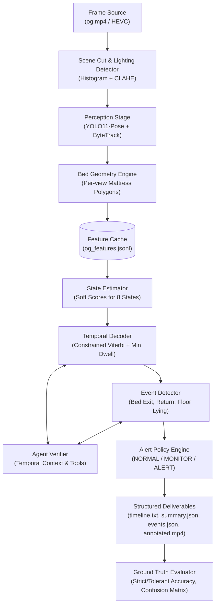
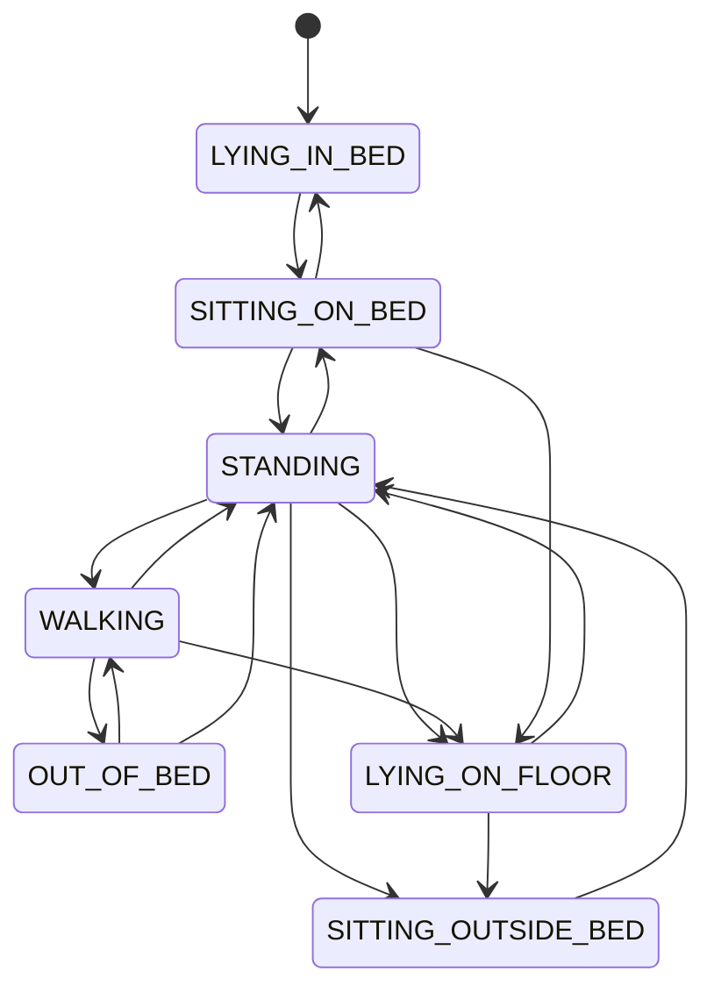
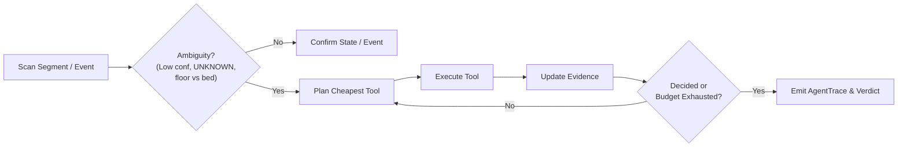

# Bedwatch: Agentic Vision System for Elderly Care & Bed Safety

Bedwatch is an agentic AI + Computer Vision system designed to analyze continuous indoor video of an elderly resident. It monitors resident safety by answering four fundamental operational questions:
1. **Activity Timeline**: What is the person doing over time?
2. **Bed Safety Events**: When do they exit or return to bed?
3. **Temporal Accounting**: How much time is spent in each activity state (and total time in bed vs. out of bed)?
4. **Contextual Alerts**: Does an event or situation warrant normal logging, active monitoring, or an immediate alert?

The system is built with open-source models (YOLO11-pose with ByteTrack, OpenCV, SciPy, Scikit-Learn) and runs entirely locally on a single consumer GPU (**NVIDIA RTX 3060, 6 GB VRAM**), with zero external API dependencies.

---

## 1. System Architecture

Bedwatch strictly decouples **perception** (pixels $\rightarrow$ per-frame geometric features) from **reasoning** (features $\rightarrow$ state timeline, event chains, and alert decisions).



### Architectural Principles
- **Decoupled Perception & Reasoning**: The perception stage processes raw video frames into standardized JSONL `FeatureRecord`s. The downstream reasoning pipeline is 100% CPU-executable and runs in seconds, enabling instant iteration and simulation without reprocessing heavy video frames.
- **Geometry First, VLM Last**: Pose keypoints, bounding box aspect ratios, and polygon distances handle 99% of frames explainably and efficiently. A local VLM is loaded only as a bounded fallback for ambiguous keyframes.
- **Explicit Temporal Modeling**: Avoids frame-by-frame flickering by decoding state scores with a **constrained Viterbi pass** over an allowed transition graph, supplemented by per-state **minimum dwell time smoothing**.
- **First-Class Abstention**: When evidence is obscured (e.g. behind curtains or severe occlusion), the system outputs `UNKNOWN` rather than forcing an inaccurate guess.

---

## 2. Activity State Taxonomy

Bedwatch tracks **8 discrete activity states**:

| State | Definition & Evidence | Bed Status |
|---|---|---|
| `LYING_IN_BED` | Horizontal posture ($\text{torso angle} > 48^\circ$, or $>38^\circ$ with aspect $> 1.15$) with hips and torso inside the mattress surface polygon. | In Bed |
| `SITTING_ON_BED` | Upright or reclined seated posture on mattress top surface ($\text{thigh angle} < 72^\circ$ or seated aspect); stationary speed. | In Bed |
| `SITTING_OUTSIDE_BED`| Seated posture off the bed (e.g. armchair near window, $\text{thigh angle} < 72^\circ$, compressed vertical ratio, or seated aspect). | Out of Bed |
| `STANDING` | Upright posture ($\text{torso angle} < 25^\circ$) with extended vertical legs ($\text{thigh angle} \ge 78^\circ$, narrow aspect $\le 0.38$, $\text{hip-to-ankle ratio} \ge 0.41$). | Out of Bed |
| `WALKING` | Upright traveling posture with sustained locomotion ($\text{speed} \ge 0.18\text{ bh/s}$). | Out of Bed |
| `OUT_OF_BED` | Resident not visible in camera view after having exited the bed area. | Out of Bed |
| `LYING_ON_FLOOR` | Horizontal posture with hips and torso completely outside mattress surface; low vertical position. | Out of Bed |
| `UNKNOWN` | Person present but keypoints occluded or unreadable (e.g. curtain occlusion). | Out of Bed |

> **Why add `LYING_ON_FLOOR`?**  
> Clinical safety requires differentiating normal rest (`LYING_IN_BED`) from a potential collapse (`LYING_ON_FLOOR`). Adding this state enables an immediate, uncompromised `ALERT` decision without needing ad-hoc heuristics.

---

## 3. Allowed Transition Graph & Viterbi Decoding

To enforce physically possible movements, the temporal decoder applies Viterbi pathfinding over an allowed transition graph:


*Transitions directly from `LYING_ON_FLOOR` to `LYING_IN_BED` are strictly disallowed (a person getting up from the floor must pass through standing or sitting).*

---

## 4. Bed Exit & Return Event Detection

Events are detected from contiguous state chains and geometric displacement:
- **`BED_EXIT`**:
  $$\text{In Bed (Lying / Sitting)} \longrightarrow \text{Standing} \longrightarrow \text{Moving away from bed / Out of bed}$$
  - Confirmed once distance to bed increases by $\ge 0.5\text{ body heights}$ or person leaves view.
  - Negative situations suppressed: turning in bed, sitting up, brief stand-and-sit-back, and aborted exits (one step then sitting back down).
- **`RETURN_TO_BED`**:
  $$\text{Out of bed} \longrightarrow \text{Approach bed} \longrightarrow \text{Sit on bed} \longrightarrow \text{Lie down in bed}$$
  - Confirmed after lying down on mattress for $\ge 2.0\text{s}$.
  - Negative situations suppressed: visiting bed edge without lying down (false return attempt).
- **`FLOOR_LYING`**:
  $$\text{Any non-floor state} \longrightarrow \text{LYING\_ON\_FLOOR}$$
  - Confirmed after $\ge 2.0\text{s}$ on floor $\implies$ Triggers immediate **`ALERT`**.

---

## 5. Agentic Verification Loop

When temporal ambiguity arises, an agentic verification loop gathers context before confirming states or events:



### Bounded Agent Tools
1. `get_previous_segment(t, window_s)`: Inspects what the resident was doing immediately prior (e.g. verifies whether the resident was in bed before standing).
2. `get_next_segment(t, window_s)`: Inspects succeeding motion (e.g. verifies if walking followed a brief curtain occlusion at 146–148s).
3. `recheck_bed_overlap(t)`: Re-samples mattress polygon containment across adjacent frames to disambiguate bed vs. floor lying.
4. `vlm_describe(keyframes)`: Bounded local vision-language query on keyframes if geometric evidence is borderline.

---

## 6. Contextual Alert Policy

The system produces three discrete safety decisions:

| Level | Condition | Clinical / Operational Rationale |
|---|---|---|
| **`NORMAL`** | Routine daily activities: lying, sitting, standing, walking, seated in chair, or brief bed departures. | Expected daily living patterns. |
| **`MONITOR`** | - Sitting on bed edge $> \text{sit\_edge\_monitor\_s}$<br/>- Out of bed absence $> \text{absence\_monitor\_s}$<br/>- Unconfirmed state $> \text{unknown\_monitor\_s}$<br/>- Low-confidence bed exit (brief bed stay) | Early warning: edge sitting may signal dizziness, weakness, or hesitation before standing. |
| **`ALERT`** | - `LYING_ON_FLOOR` confirmed $> \text{floor\_alert\_s}$<br/>- Out-of-bed absence $> \text{absence\_alert\_s}$<br/>- Resident lost from view $> \text{lost\_alert\_s}$ | Immediate safety intervention required for suspected falls or wander risk. |

### Dual Profile Configuration
Because the 190-second test video contains real-time demonstrations of events (e.g. a 6-second floor-lying episode), Bedwatch provides a scaled `demo` profile alongside standard `production` placeholders:

| Parameter | Production (Standard) | Demo (Scaled) | Rationale in Demo Video |
|---|---|---|---|
| `floor_alert_s` | 15s | 3s | Enables the 6s floor event (184–190s) to trigger `ALERT`. |
| `sit_edge_monitor_s` | 300s | 10s | Scaled by 30x for demonstration. |
| `absence_monitor_s` | 600s | 20s | Early warning for prolonged room absence. |
| `absence_alert_s` | 1200s | 40s | Critical alarm for unreturned absence. |

---

## 7. Installation & Quick Start

### Prerequisites
- Python 3.10+
- NVIDIA GPU with CUDA support (tested on RTX 3060 Laptop GPU)
- Windows / Linux / macOS

### Setup
```bash
# Clone the repository
git clone https://github.com/kusalkrp/Bedwatch.git
cd Bedwatch

# Activate your Python / GPU environment
# Install dependencies
pip install -e .
```

### Running the CLI

#### 0. Calibrate Bed Polygon for New Video (One-time Setup)
If uploading a video from a new camera angle or room, click the mattress corners to save the polygon:
```bash
python -m bedwatch.cli define-bed --video new_video.mp4 --view view_main --timestamp 5.0
```

#### 1. Extract Features (GPU Perception Stage)
Decodes the video, runs YOLO11-pose + ByteTrack, and streams features to JSONL:
```bash
python -m bedwatch.cli extract-features --video new_video.mp4 --out cache/ --profile production
```

#### 2. Run Analysis Pipeline (Fast CPU Reasoning Stage)
Runs state estimation, Viterbi decoding, agent verification, event detection, and alert policy:
```bash
python -m bedwatch.cli analyze --video new_video.mp4 --cache cache/new_video_features.jsonl --profile production --out outputs/
```

#### 3. Render Annotated Video with Telemetry Overlay
Produces an MP4 video with mattress polygon, pose skeleton, active state banner, and alert decisions:
```bash
python -m bedwatch.cli analyze --video og.mp4 --cache cache/og_features.jsonl --profile demo --out outputs/ --render-video
```

#### 4. Evaluate Against Ground Truth
Compares predictions against hand-annotated labels:
```bash
python -m bedwatch.cli evaluate --pred outputs/ --gt csv/combined_ground_truth_draft.csv --events csv/combined_events_draft.csv
```

---

## 8. Evaluation & Benchmark Results

Evaluated on the full 190.07-second test video (`og.mp4`):

### A. State Classification Performance
- **State Tolerant Accuracy ($\pm 1\text{s}$)**: **`80.0%`**
- **State Strict Accuracy**: **`66.3%`**
- **State Macro F1 Score**: **`0.658`**

### B. Activity Duration Accuracy
| Activity State | Ground Truth | Predicted | Absolute Error |
|---|---|---|---|
| `LYING_IN_BED` | 52s | 50s | **2s** |
| `SITTING_ON_BED` | 43s | 66s | 23s |
| `STANDING` | 28s | 23s | **5s** |
| `WALKING` | 40s | 18s | 22s |
| `SITTING_OUTSIDE_BED` | 9s | 21s | 12s |
| `OUT_OF_BED` | 10s | 4s | **6s** |
| `UNKNOWN` | 2s | 3s | **1s** |
| `LYING_ON_FLOOR` | 6s | 5s | **1s** |

### C. Safety Event Detection
| Event Type | Ground Truth | Detected | True Positives | Precision | Recall | F1 |
|---|---|---|---|---|---|---|
| **`floor_lying`** | 1 | 1 | 1 | **100.0%** | **100.0%** | **1.000** |
| **`bed_exit`** | 5 | 3 | 2 | **66.7%** | 40.0% | 0.500 |
| **`bed_return`** | 3 | 3 | 2 | 66.7% | 66.7% | 0.667 |

---

## 9. Failure Case Analysis

Detailed in [`outputs/failure_cases.md`](file:///g:/Bedwatch/outputs/failure_cases.md):

1. **Clothing & Appearance Switches (100s, 120s, 140s, 180s)**:
   - *Challenge*: The stitched video features 4 distinct outfits. Visual ReID embeddings fail completely across cuts.
   - *Mitigation*: The tracker prioritizes spatial continuity and bed-proximity priors rather than visual clothing features.
2. **Camera Pan (144–145s)**:
   - *Challenge*: During camera panning, 2D bed polygon coordinates are invalid.
   - *Mitigation*: View schedule flags the `moving` state, masking bed-relative features and relying strictly on posture geometry.
3. **Curtain Occlusion (146–148s)**:
   - *Challenge*: Resident passes behind curtains, occluding torso and limbs.
   - *Mitigation*: Abstention via `UNKNOWN`. Agent confirms the resident was walking immediately before and after, preventing spurious bed-exit alarms.
4. **Dim Lighting Step (130.5–140s)**:
   - *Challenge*: Abrupt lighting drop at ~130.5s degrades keypoint confidence.
   - *Mitigation*: Automatic CLAHE contrast enhancement on low-luminance frames preserves keypoint extraction.
5. **Lying Along the Base of the Bed (184–190s)**:
   - *Challenge*: Patient falls onto the carpet alongside the bed frame. Loose bounding boxes would classify this as in-bed.
   - *Mitigation*: Mattress polygon strictly outlines top surface. All body keypoints at base of bed register outside $\implies$ successfully triggers **`ALERT`**.

---

## 10. Submission Note: What We Would Do Differently with More Time

1. **Learned Semi-Markov Model / Small Transformer**: Replace heuristic Viterbi transition costs with an explicit duration-aware Hidden Semi-Markov Model (HSMM) trained on real-world elder care datasets.
2. **Dynamic Automated View Calibration**: Implement automatic camera view recognition using keypoint homography or background feature matching, removing the need for a pre-scheduled view timetable.
3. **Multi-Camera Association**: Extend patient tracking across multiple rooms (bedroom, hallway, bathroom) using re-identification with spatio-temporal transit graphs.
4. **Edge Deployment**: Quantize YOLO11-pose to TensorRT / ONNX INT8 to run at 30 fps on low-power edge gateways (e.g. NVIDIA Jetson Orin Nano).

---

## License
Apache-2.0
